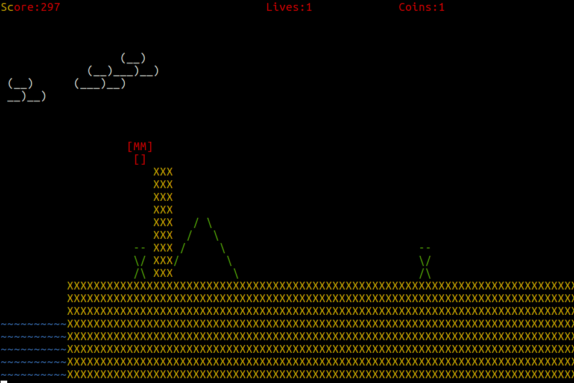

# Super Mario Brothers 


## Description

This is a very basic replica of the Super Mario Brothers which runs on Terminal using ASCII characters and is solely made using python3. Colorama package was used to introduce a colorful background. It consists of a single level with the basic mario elements like enemies, bricks, waterholes, coins, shooting power, springs, pipes, etc. One boss enemy is encountered at the end of the level. The score is incremented on the basis of how far the player has reached and the number of coins collected. Music is played using background aplay call.


## Game design and working

This game was developed using the principles of Object-Oriented Programming. Mario and the enemies inherit from a common Person Class and the entire game runs with the functioning of methods defined in the Board Class. All the update functions are defined in the Board class which in turn make use of internal functions of other classes. Polymorphism was used for the movement function of enemy and boss. The exact locations of enemies is decided by checking in their respective checkpoint arrays which can be modified anytime based on user convenience whereas the bricks, springs and coins location are fixed. The positiion for bringing in the boss can also be varied easily. All of the global configuration is handled by the Config file. The GlobalX attribute of the GlobalVar class is the key variable in storing the game's progress. The boss movement is mainly dictated by the random function. Mario is not allowed to get past the boss during the last fight. Boss health is also displayed during the fight. Although PEP8 standards were not strictly followed, the code follows its basic guidelines and has been written with comments wherever necessary.

### Mario
* Initially has 3 lives
* One bullet shooting power

### Enemy
* Dies when gets shot or mario jumps on it
* Decreases marios life when touches mario

### Boss
* Continually shoots bullets
* Moves randomly in all directions

### Bricks
* 2-types: breakable and unbreakable
* Hidden also

### Springs
* Enables mario's super jump

### Coins
* Increases score by 10 


## How To

* Run the game: 	
	```console
	bar@foo:~$ python3 core.py
	```
* Move left: Press and/or hold 'a'
* Move right: Press and/or hold 'd'
* Jump: Press 'w'
* Shoot: Press Spacebar


## Gameplay


* Scene 1


* Scene 2


* Scene 3(Shooting)


* Scene 4



* Scene 5(Spring Jump)


* (Scene 6)Boss fight


## Built With

* [Python3](https://www.python.org/download/releases/3.0/)
* [Colorama](https://pypi.org/project/colorama/)
* [Tox](https://tox.readthedocs.io/en/latest/)
* [Pytest](https://docs.pytest.org/en/latest/)

Requirements.txt contains the other relevant details.


## Author

* Vaibhav Garg(Roll N0.- 20171005)


## Easter Eggs

### Cheat Code
Pressing 9 gives an extra life.

### Superpower
In scene 3, making a straight jump after standing at the topmost brick reveals a hidden brick which enhances Mario's shooting power.

## Testing And Refactoring

### Testing 
Automated testing integrated with Tox and Pytest.

* Test the game: 	
	```console
	bar@foo:~$ tox
	```

### Refactoring
Code has been refactored considering Pylint Standards and variious code smells.